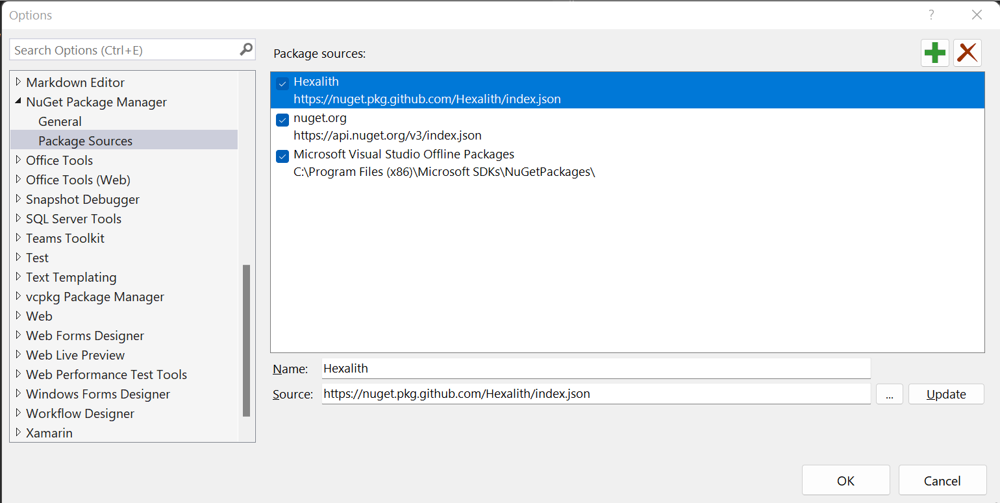

# Add preview package source

In this article, we are going to add a new package source pointing to the preview packages.  
The preview packages are built each time some code is committed on the `main` branch, compared to the ones on NuGet, built from the `tags/vx.x.x` refs.  
They are the most up to date versions but not the most stable and can contain breaking changes.

!!! warning
    We do not suggest you to use the dev packages in production.

## Adding Hexalith preview Feed to Visual Studio

In order to be able to use the GitHub __preview__ feed from Visual Studio, you need to add Hexalith packages source. The feed url <https://nuget.pkg.github.com/Hexalith/index.json>

```powershell
dotnet nuget add source "https://nuget.pkg.github.com/Hexalith/index.json" --name "Hexalith" --username "<User>" --password "<PersonalAccessToken>"
```
To remove the source, use the following command:

```powershell
dotnet nuget remove source "Hexalith"
```

Visual studio package sources :


